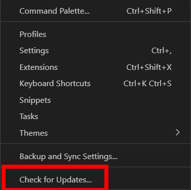

# :question: Frequently Asked Questions

This FAQ addresses **common errors** encountered during the installation process. Please follow the steps below, and if the error persists, **contact a TA** for further assistance.

<details>
  <summary markdown='span'>`__dirname is not defined` when running <code>code --install-extension</code></summary>
If you're using an older version of VS Code with WSL and encounter an error <code>__dirname is not defined</code> when trying to install a VS Code extension, you need to update VS Code first.

<br>
Open VS Code and click the Settings icon in the bottom-left corner.


Select "Check for Updates" and install any updates available.



After you've updated VS Code to the latest version, you should be able to install the extension.

</details>

<details>
  <summary markdown='span'>`Running as root is not recommended` when starting Jupyter</summary>
If you receive an error message saying <code>Running as root is not recommended</code> when starting Jupyter, you need exit root by typing:

```bash
exit
```

Now you should be using your normal user. Restart Jupyter by running:

```bash
jupyter notebook
```

Alternatively, you can use the <code>--allow-root</code> option to run Jupyter as root:

```bash
jupyter notebook --allow-root
```

</details>

<details>
  <summary markdown='span'>`No web browser found` when starting Jupyter</summary>
If you receive an error message saying <code>No web browser found: could not locate runnable browser</code> or Google Chrome doesn't open automatically when you start Jupyter from WSL, follow these steps:

Open the Jupyter configuration file:

```bash
code $HOME/.jupyter/jupyter_notebook_config.py
```

Locate the following line in the configuration file:

```python
# c.NotebookApp.browser = ''
```

Uncomment and modify the line by replacing it with one of these paths:

```python
c.NotebookApp.browser = '/mnt/c/Program Files/Google/Chrome/Application/chrome.exe'
```

or

```python
c.NotebookApp.browser = '/mnt/c/Program Files (x86)/Google/Chrome/Application/chrome.exe'
```

Save the file and close your text editor. Then restart Jupyter using:

```bash
jupyter notebook
```

If Chrome still doesn’t open automatically, repeat these steps with the alternative path.

</details>

<details>
  <summary markdown='span'>Cannot select a kernel in VS Code</summary>

If you're unable to select a kernel in VS Code for your Jupyter Notebook (as shown in the image below), start by ensuring the Jupyter VS Code extension is installed and up to-date.


Next, verify <code>ipykernel</code> is installed in your virtual environment by running:

```bash
pip freeze | grep ipykernel
```

If no output is produced, that means you need to install <code>ipykernel</code>:

```bash
pip install ipykernel
```

Afterward, reopen VS Code and try to run your Jupyter Notebook again.

</details>
