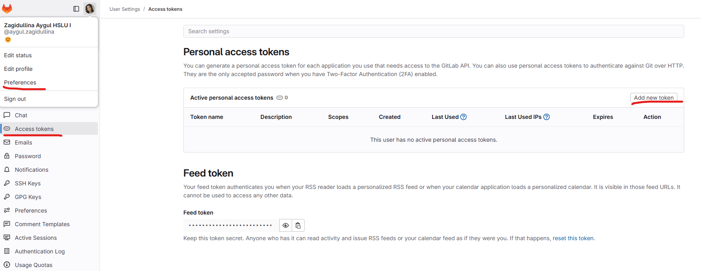
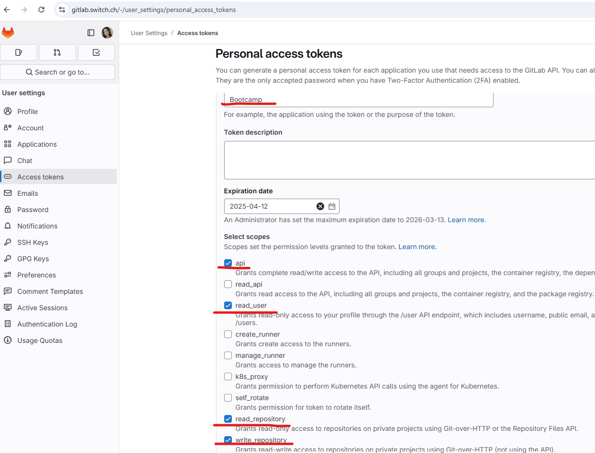
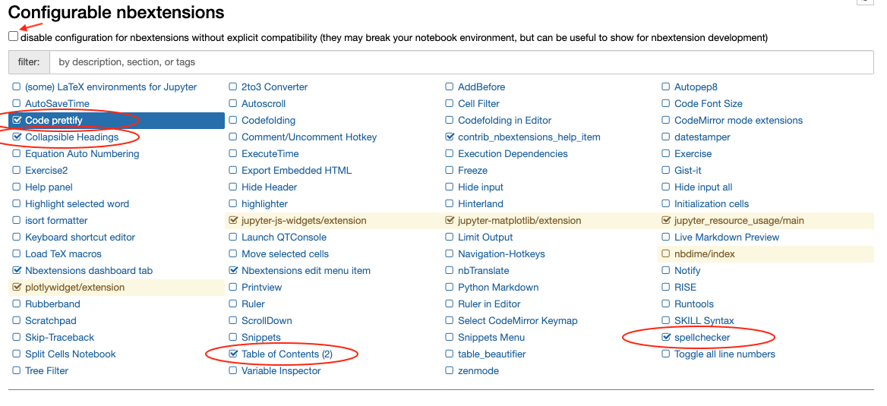

# Setup instructions

You will find below the instructions to set up you computer for the NLP Bootcamp.  
Please **read them carefully and execute all commands in the following order**. If you get stuck, don't hesitate to ask a teacher for help :raising_hand:

Let's start :rocket:

## GitHub account

Have you signed up to GitHub? If not, [do it right away](https://github.com/join).

:point_right: **[Upload a picture](https://github.com/settings/profile)** and put your name correctly on your GitHub account.

:point_right: **[Enable Two-Factor Authentication (2FA)](https://docs.github.com/en/authentication/securing-your-account-with-two-factor-authentication-2fa/configuring-two-factor-authentication#configuring-two-factor-authentication-using-text-messages)**. GitHub will send you text messages with a code when you try to log in. This is important for security and also will be required in order to contribute code on GitHub.

## Visual Studio Code

### Installation

Let's install [Visual Studio Code](https://code.visualstudio.com) text editor.

Copy (`Ctrl` + `C`) the commands below then paste them in your terminal (`Ctrl` + `Shift` + `v`):

```bash
wget -qO- https://packages.microsoft.com/keys/microsoft.asc | gpg --dearmor > packages.microsoft.gpg
```

```bash
sudo install -o root -g root -m 644 packages.microsoft.gpg /etc/apt/trusted.gpg.d/
```

```bash
sudo sh -c 'echo "deb [arch=amd64,arm64,armhf signed-by=/etc/apt/trusted.gpg.d/packages.microsoft.gpg] https://packages.microsoft.com/repos/code stable main" > /etc/apt/sources.list.d/vscode.list'
```

```bash
rm -f packages.microsoft.gpg
```

```bash
sudo apt update
```

```bash
sudo apt install -y code
```

These commands will ask for your password: type it in.

:warning: When you type your password, nothing will show up on the screen, **that's normal**. This is a security feature to mask not only your password as a whole but also its length. Just type in your password and when you're done, press `Enter`.

### Launching from the terminal

Now let's launch VS Code from **the terminal**:

```bash
code
```

:heavy_check_mark: If a VS Code window has just opened, you're good to go :+1:

:x: Otherwise, please **contact a teacher**

## VS Code Extensions

### Installation

Let's install some useful extensions to VS Code.

```bash
code --install-extension ms-vscode.sublime-keybindings
code --install-extension emmanuelbeziat.vscode-great-icons
code --install-extension MS-vsliveshare.vsliveshare
code --install-extension ms-python.python
code --install-extension KevinRose.vsc-python-indent
code --install-extension ms-python.vscode-pylance
code --install-extension ms-toolsai.jupyter
```

Here is a list of the extensions you are installing:

- [Sublime Text Keymap and Settings Importer](https://marketplace.visualstudio.com/items?itemName=ms-vscode.sublime-keybindings)
- [VSCode Great Icons](https://marketplace.visualstudio.com/items?itemName=emmanuelbeziat.vscode-great-icons)
- [Live Share](https://marketplace.visualstudio.com/items?itemName=MS-vsliveshare.vsliveshare)
- [Python](https://marketplace.visualstudio.com/items?itemName=ms-python.python)
- [Python Indent](https://marketplace.visualstudio.com/items?itemName=KevinRose.vsc-python-indent)
- [Pylance](https://marketplace.visualstudio.com/items?itemName=ms-python.vscode-pylance)
- [Jupyter](https://marketplace.visualstudio.com/items?itemName=ms-toolsai.jupyter)

### Live Share configuration

[Visual Studio Live Share](https://visualstudio.microsoft.com/services/live-share/) is a VS Code extension which allows you to share the code in your text editor for debugging and pair-programming: let's set it up!

Launch VS Code from your terminal by typing `code` and pressing `Enter`.

Click on the little arrow at the bottom of the left bar :point_down:


- Click on the "Share" button, then on "GitHub (Sign in using GitHub account)".
- A popup appears asking you to sign in with GitHub: click on "Allow".
- You are redirected to a GitHub page in you browser asking you to authorize Visual Studio Code: click on "Continue" then "Authorize github".
- VS Code may display additional pop-ups: close them by clicking "OK".

That's it, you're good to go!

## Command line tools

### Zsh & Git

Instead of using the default `bash` [shell](<https://en.wikipedia.org/wiki/Shell_(computing)>), we will use `zsh`.

We will also use [`git`](https://git-scm.com/), a command line software used for version control.

Let's install them, along with other useful tools:

- Open an **Ubuntu terminal**
- Copy and paste the following commands:

```bash
sudo apt update
```

```bash
sudo apt install -y curl git imagemagick jq unzip vim zsh tree
```

These commands will ask for your password: type it in.

:warning: When you type your password, nothing will show up on the screen, **that's normal**. This is a security feature to mask not only your password as a whole but also its length. Just type in your password and when you're done, press `Enter`.

### GitHub CLI installation

Let's now install [GitHub official CLI](https://cli.github.com) (Command Line Interface). It's a software used to interact with your GitHub account via the command line.

In your terminal, copy-paste the following commands and type in your password if asked:

```bash
sudo apt remove -y gitsome # gh command can conflict with gitsome if already installed
curl -fsSL https://cli.github.com/packages/githubcli-archive-keyring.gpg | sudo dd of=/usr/share/keyrings/githubcli-archive-keyring.gpg
```

```bash
echo "deb [arch=$(dpkg --print-architecture) signed-by=/usr/share/keyrings/githubcli-archive-keyring.gpg] https://cli.github.com/packages stable main" | sudo tee /etc/apt/sources.list.d/github-cli.list > /dev/null
```

```bash
sudo apt update
```

```bash
sudo apt install -y gh
```

To check that `gh` has been successfully installed on your machine, you can run:

```bash
gh --version
```

:heavy_check_mark: If you see `gh version X.Y.Z (YYYY-MM-DD)`, you're good to go :+1:

:x: Otherwise, please **contact a teacher**

## Chrome - your browser

Install the Google Chrome browser if you haven't got it already and set it as a **default browser**.

Follow the steps for your system from this link :point_right: [Install Google Chrome](https://support.google.com/chrome/answer/95346?co=GENIE.Platform%3DDesktop&hl=en-GB)

**Why Chrome?**

We recommend to use it as your default browser as it's most compatible with testing or running your code, as well as working with Google Cloud Platform.

## Oh-my-zsh

Let's install the `zsh` plugin [Oh My Zsh](https://ohmyz.sh/).

In a terminal execute the following command:

```bash
sh -c "$(curl -fsSL https://raw.github.com/ohmyzsh/ohmyzsh/master/tools/install.sh)"
```

If asked "Do you want to change your default shell to zsh?", press `Y`

At the end your terminal should look like this:


:heavy_check_mark: If it does, you can continue :+1:

:x: Otherwise, please **ask a teacher**

## GitHub CLI

CLI is the acronym of [Command-line Interface](https://en.wikipedia.org/wiki/Command-line_interface).

In this section, we will use [GitHub CLI](https://cli.github.com/) to interact with GitHub directly from the terminal.

It should already be installed on your computer from the previous commands.

First in order to **login**, copy-paste the following command in your terminal:

:warning: **DO NOT edit the `email`**

```bash
gh auth login -s 'user:email' -w
```

gh will ask you few questions:

`What is your preferred protocol for Git operations?` With the arrows, choose `SSH` and press `Enter`. SSH is a protocol to log in using SSH keys instead of the well known username/password pair.

`Generate a new SSH key to add to your GitHub account?` Press `Enter` to ask gh to generate the SSH keys for you.

If you already have SSH keys, you will see instead `Upload your SSH public key to your GitHub account?` With the arrows, select your public key file path and press `Enter`.

`Enter a passphrase for your new SSH key (Optional)`. Type something you want and that you'll remember. It's a password to protect your private key stored on your hard drive. Then press `Enter`.

`Title for your SSH key`. You can leave it at the proposed "GitHub CLI", press `Enter`.

You will then get the following output:

```bash
! First copy your one-time code: 0EF9-D015
- Press Enter to open github.com in your browser...
```

Select and copy the code (`0EF9-D015` in the example), then press `Enter`.

Your browser will open and ask you to authorize GitHub CLI to use your GitHub account. Accept and wait a bit.

Come back to the terminal, press `Enter` again, and that's it.

To check that you are properly connected, type:

```bash
gh auth status
```

:heavy_check_mark: If you get `Logged in to github.com as <YOUR USERNAME> `, then all good :+1:

:x: If not, **contact a teacher**.

## GitLab CLI

In addition to GitHub, we'll be using GitLab from the CLI to access the course material.

Let's start by installing the CLI tool:

```bash
sudo apt install glab
```

As GitLab is hosted on gitlab.switch.ch, we need to set this in the configuration:

```bash
glab config set -g host gitlab.switch.ch
```

Now it's time to generate a Personal Access Token (PAT) in order to login to your account. Open the [course repository](https://gitlab.switch.ch/hslu/continuing-education/bootcamp-NLP-LLM/bootcamp_fs2025) and navigate to "Preferences" by clicking your profile in the top left corner.


Then click on "Access tokens" and add a new token.



You can name the token however you want, just be sure to not set an expiration date and to select the options circled in red:



Finally, click on "Create personal access token" and copy the token.

Come back to the terminal and run:

```bash
glab auth login
```

glab will ask you few questions:

`What GitLab instance do you want to log into?` With the arrows, choose the previously configured host `gitlab.switch.ch` and press `Enter`.

`How would you like to sign in?` Choose `Token` with the arrows and press `Enter`. Now paste your personal access token into the terminal.

`Choose default Git protocol:`: Choose the `HTTPS` protocol and press `Enter`.

`Authenticate Git with your GitLab credentials? (Y/n)` Type `Y` and press `Enter`.

You're all set! To check that you are properly connected, type:

```bash
glab auth status
```

:heavy_check_mark: If you get `Logged in to gitlab.switch.ch as <YOUR USERNAME>` , then all good :+1:

:x: If not, contact a teacher.

## Cloning the course repository

By cloning the course repository, you will have access to all the material locally on your computer. Run the following command in your terminal:

```bash
glab repo clone hslu/continuing-education/bootcamp-NLP-LLM/bootcamp_fs2025
```

## Dotfiles

We'll start with a default configuration provided in the course materials.
Go to the `dotfiles` folder and run the installer:

```bash
cd dotfiles && bash install.sh
```

Please now **quit** all your opened terminal windows.

## Disable SSH passphrase prompt

You don't want to be asked for your passphrase every time you communicate with a distant repository. So, you need to add the plugin `ssh-agent` to `oh my zsh`:

First, open the `.zshrc` file:

```bash
code ~/.zshrc
```

Then:

- Spot the line starting with `plugins=`
- Add `ssh-agent` at the end of the plugins list

:heavy_check_mark: Save the `.zshrc` file with `Ctrl` + `S` and close your text editor.

## direnv

[direnv](https://direnv.net/) is a shell extension. It makes it easy to deal with per project environment variables. This will be useful in order to customize the behavior of your code.

```bash
sudo apt-get update; sudo apt-get install direnv
echo 'eval "$(direnv hook zsh)"' >> ~/.zshrc
```

## Installing Python (with [`pyenv`](https://github.com/pyenv/pyenv))

### Uninstall `conda`

As we are using `pyenv` to install and manage our Python version, we need to uninstall [`conda`](https://docs.conda.io/projects/conda/en/latest/), another package manager you may have on your machine if you previously installed [Anaconda](https://www.anaconda.com/). Thus, we are preventing any possible Python version issue later.

Check if you have `conda` installed on your machine:

```bash
conda list
```

If you have `zsh: command not found: conda`, you can **skip** the uninstall of `conda` and jump to the **Install `pyenv`** section.

<details>
    <summary markdown='span'><code>conda</code> uninstall instructions</summary>

- Install the Anaconda-Clean package from your terminal and run the cleaning

```bash
conda install anaconda-clean
anaconda-clean --yes
```

- Remove every Anaconda directories

```bash
rm -rf ~/anaconda2
rm -rf ~/anaconda3
rm -rf ~/.anaconda_backup
```

- Remove Anaconda path from your `.bash_profile`
  - Open the file with `code ~/.bash_profile`
  - If the file opens find the line matching the following pattern `export PATH="/path/to/anaconda3/bin:$PATH"` and delete the line
  - Save the file with `CTRL` + `s`
- Restart your terminal with `exec zsh`
- Remove Anaconda initialization from your `.zshrc`: - Open the file with `code ~/.zshrc` - Remove the code lines starting from `>>> conda initialize >>>` to `<<< conda initialize <<<`
</details>

### Install `pyenv`

Ubuntu comes with an outdated version of Python that we don't want to use. You might already have installed Anaconda or something else to tinker with Python and Data Science packages. All of this does not really matter as we are going to do a professional setup of Python where you'll be able to switch which version you want to use whenever you type `python` in the terminal.

First let's install `pyenv` with the following Terminal command:

```bash
git clone https://github.com/pyenv/pyenv.git ~/.pyenv
exec zsh
```

Let's install some [dependencies](https://github.com/pyenv/pyenv/wiki/common-build-problems#prerequisites) needed to build Python from `pyenv`:

```bash
sudo apt-get update; sudo apt-get install make build-essential libssl-dev zlib1g-dev \
libbz2-dev libreadline-dev libsqlite3-dev wget curl llvm \
libncursesw5-dev xz-utils tk-dev libxml2-dev libxmlsec1-dev libffi-dev liblzma-dev \
python3-dev
```

### Install Python

Let's install the [latest stable version of Python](https://www.python.org/doc/versions/) supported by our curriculum:

```bash
pyenv install 3.12.0
```

This command might take a while, this is perfectly normal. Don't hesitate to help other students seated next to you!

<details>
  <summary>🛠 Troubleshooting `pyenv` not found</summary>

If you encounter an error `Command 'pyenv' not found`: execute the following line:

```bash
source ~/.zprofile
```

Then try to install Python again:

```bash
pyenv install 3.12.0
```

If `pyenv` is still not found, contact a teacher.

</details>
<br>

OK once this command is complete, we are going to tell the system to use this version of Python **by default**. This is done with:

```bash
pyenv global 3.12.0
exec zsh
```

To check if this worked, run `python --version`. If you see `3.12.0`, perfect! If not, ask a TA that will help you debug the problem thanks to `pyenv versions` and `type -a python` (`python` should be using the `.pyenv/shims` version first).

## Python Virtual Environment

Before we start installing relevant Python packages, we will isolate the setup for the course into a **dedicated** virtual environment. We will use a `pyenv` plugin called [`pyenv-virtualenv`](https://github.com/pyenv/pyenv-virtualenv).

First let's install this plugin:

```bash
git clone https://github.com/pyenv/pyenv-virtualenv.git $(pyenv root)/plugins/pyenv-virtualenv
exec zsh
```

Let's create the virtual environment we are going to use during the whole course:

```bash
pyenv virtualenv 3.12.0 iai_course
```

Let's now set the virtual environment with:

```bash
pyenv global iai_course
```

Great! Anytime we'll install Python package, we'll do it in that environment.

## Python packages

Now that we have a pristine `iai_course` virtual environment, it's time to install some packages in it.

First, let's upgrade `pip`, the tool to install Python Packages from [pypi.org](https://pypi.org). In the latest terminal where the virtualenv `iai_course` is activated, run:

```bash
pip install --upgrade pip
```

Then let's install some packages for the first weeks of the program. To do so, navigate to the cloned course material folder and run the following command:

```bash
pip install -r requirements/linux.txt
```

## `jupyter` notebook extensions

Pimp your `jupyter` notebooks with awesome extensions:

```bash
# install nbextensions
jupyter contrib nbextension install --user
jupyter nbextension enable toc2/main
jupyter nbextension enable collapsible_headings/main
jupyter nbextension enable spellchecker/main
jupyter nbextension enable code_prettify/code_prettify
```

### Custom CSS

Improve the display of the [`details` disclosure elements](https://developer.mozilla.org/en-US/docs/Web/HTML/Element/details) in your notebooks.

Open `custom/custom.css` in the config directory:

```bash
cd $(jupyter --config-dir)
mkdir -p custom
touch custom/custom.css
code custom/custom.css
```

Edit `custom.css` with:

```css
summary {
  cursor: pointer;
  display: list-item;
}
summary::marker {
  font-size: 1em;
}
```

You can close VS Code.

### `jupyter` check up

Let's reset your terminal:

```bash
exec zsh
```

Now, check you can launch a notebook server on your machine:

```bash
jupyter notebook
```

Your web browser should open on a `jupyter` window:


Click on `New`:


A tab should open on a new notebook:


### `nbextensions` check up

Perform a sanity check for `jupyter notebooks nbextensions`. Click on `Nbextensions`:


Untick _"disable configuration for nbextensions without explicit compatibility"_ then check that _at least_ all `nbextensions` circled in red are enabled:



You can close your web browser then terminate the jupyter server with `CTRL` + `C`.

### Python setup check up

Make sure you can run Jupyter:

```bash
jupyter notebook
```

And open a `Python 3` notebook.

Make sure that you are running the correct python version in the notebook. Open a cell and run :

```python
import sys; sys.version
```

Here you have it! A complete python virtual env with all the third-party packages you'll need for the whole course.

## DBeaver

Download and install [DBeaver](https://dbeaver.io/), a free and open source powerful tool to connect to any database, explore the schema and even **run SQL queries**.

## Docker 🐋

Docker is an open platform for developing, shipping, and running applications.

_if you already have Docker installed on your machine please update with the latest version_

### Install Docker

Go to [Docker install documentation](https://docs.docker.com/engine/install/ubuntu/#install-using-the-repository).

Then follow the tutorial instructions to install Docker **using the repository**. There are 2 steps:

1. Set up Docker's apt repository.
2. Install the Docker packages.

Now, let's make sure we can run `docker` without `sudo`.

Run the following commands one by one:

```bash
sudo groupadd docker
sudo usermod -aG docker $USER
newgrp docker
sudo rm -rf ~/.docker/
```

When finished, run the following command:

```bash
docker run hello-world
```

The following message should print:


