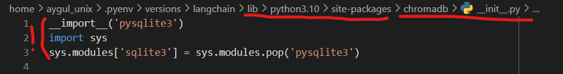

# Langchain App 🔗

In this task you'll leverage the power of Transformer-based models by creating a LangChain app that automatically reviews code. This will push beyond simplistic Transformer models and show what we can achieve by taking large, powerful, pre-trained models and integrating them with our own data.

## Step 1: Python Environment Setup
Create a Python Virtual Environment: For this coding problem, you'll need to create a Python virtual environment using pyenv and virtualenv. This isolates your project dependencies from your global Python installation - we have provided you with specific requirements in a `langchain_requirements.txt` file for specifically this coding problem and we don't want you to tamper with other versions you have in your own environment.


```bash
pyenv virtualenv 3.10.6 langchain
pyenv local langchain
pip install -r "langchain_requirements.txt"
```

## Step 2: Obtain and Secure Your OpenAI API Key

Obtain an OpenAI API Key: If you haven't already, sign up for an OpenAI account and obtain your API key by following the instructions [here](https://openai.com/blog/openai-api). You'll start with $5 of credit, which is ample for this coding problem.

Secure Your API Key: Store your OpenAI API key in an environment variable named OPENAI_API_KEY. This is crucial for security, as hardcoding your API key in your source code can lead to unintended exposure and misuse.

```bash
export OPENAI_API_KEY='your_api_key_here'
```

You can access it within your script using a line such as `openai_api_key = os.getenv('OPENAI_API_KEY')`. If this seems unfamiliar, don't worry!


## Step 3: Understanding the coding problem

**What is LangChain?**

LangChain is a framework designed for building applications powered by language models. It supports data-aware and agentic applications, allowing language models to interact with their environment and other data sources. LangChain simplifies working with LLMs, offering modular components for building or customizing applications. You can check out its documentation [here](https://python.langchain.com/docs/get_started/introduction) with some (very) helpful tutorials.

**The App Functionality**

Our task is to create a Python file named app.py that:

Takes the location of a code file as an argument (using `sys.argv`)
Outputs a score out of 10, evaluating the quality of the coded solution, along with suggestions for improvement.

For example:

```bash
python app.py "../Python/SQL-Basics/Interacting-With-Code/queries.py"
```
might output:

```
The code is a 6/10. Improvements that can be made include adding a docstring to the functions, using more descriptive variable names, and formatting the code better for improved readability.
```

Leverage the LangChain framework and your OpenAI API key to create the described application. This app will demonstrate your ability to integrate language models into software applications, providing valuable feedback on code quality and suggesting improvements.

Remember to set a usage limit on your OpenAI account to avoid unexpected charges and to deactivate your LangChain virtual environment when you're done working on the coding problem.

***Good luck, and have fun building your Langchain app! 🚀***

Note (Troubleshooting): https://gist.github.com/defulmere/8b9695e415a44271061cc8e272f3c300

Use the path as in the screenshot below, however replace for your own user_name:


